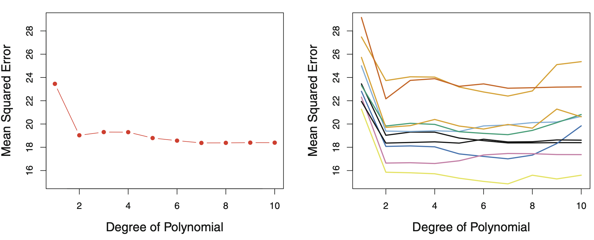
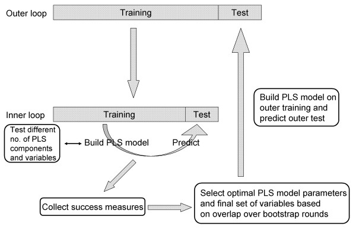

# Validation

* Generalization performance of the model measures the predictive power of a learning method on new, out-sample data. 

* Leave-d-out cross-validation (for example LOOCV)

* K-fold cross-validation: Larger bias than LOOCV. It is not which one whether it has less variance

* Random divisions into test- and training-data


---
# Validation set approach


```{r, echo=FALSE,out.width="80%", out.height="60%",fig.show='hold',fig.align='center'}

``` 

* Left: Validation error estimates for a single split into training and validation data sets.

* Right: The validation method was repeated ten times, each time using a different random split of the observations into a training set and a validation set.

* This illustrates the variability in the estimated test MSE that results from this approach.


---
# Cross validation

* Model selection: Choosing tuning parameter or model that yields the smallest expected test MSE

* Model assessment: (procedure assesment) estimate the expected test MSE that you will have


---
# Cross-validation of a procedure

* Consider you want to use cross validation to validate your model selection and model assessment.

* Your colleague suggests to select the best model with CV and assess it with CV

* What's the problem of this approach? 


---
# Cross-validation of a procedure

* Consider you want to use cross validation to validate your model selection and model assessment.

* Your colleague suggests to select the best model with CV and assess it with CV

* What's the problem of this approach? 

* Too optimistic! 

* What would you do if you were given a new dataset?


---
# Cross-validation of a procedure

* Put your whole procedure in a CV

* What if your model selection needs a CV on itself?

* You need a double CV


---
# Double CV

* Example for partial least squares estimation (PLS):

```{r, echo=FALSE,out.width="80%", out.height="60%",fig.show='hold',fig.align='center'}

``` 


---
# Example - wrong approach


* Naively, you want to predict a label, e.g. a disease, from 5000 features (genes)

* We want to pick top 20 genes and predict the label

* Pick the top genes with CV

* Based on those 20 genes, we do a KNN with $k = 1$

* Do a 10-fold CV to see how well do you perform on unseen data

* But you've already saw the whole data when picking top genes!


---
# Example

* Now let's see the real scenario in the code!

* Overly optimistic scenario

* Randomness in the training set and CV


---
--- 
# Considerations

* The features you pick might vary a bit

* How does the model look like in the end?

* Remember that this whole procedure is done to estimate how good your model will perform on a new data

* In the end, you apply your procedure to the whole data


---
# Further considerations for CV

* Always think about how would you proceed if you get a new data

* Stratification: Take class imbalance into account

* Shuffling the data: possible biases in the folds. Make sure that each data point creates an independent change on the model, without being biased by the same points before them.


---
# Thank You for Attention
References: 
* Chapter 5, part 1. James, G., Witten, D., Hastie, T. and Tibshirani, R., 2013. An introduction to statistical learning (Vol. 112, p. 18). New York: Springer.

* Simulation taken from session 4, Computational Statisitcs Course, Spring 2020, Prof. Marloes Maathuis

* Double CV taken from [this publication](https://www.researchgate.net/figure/Double-cross-validation-scheme-In-the-inner-loop-PLS-model-parameters-and-variables-are_fig2_46303817) by Lina Hultin Rosenberg

<div style="text-align: center">
  
</div>
